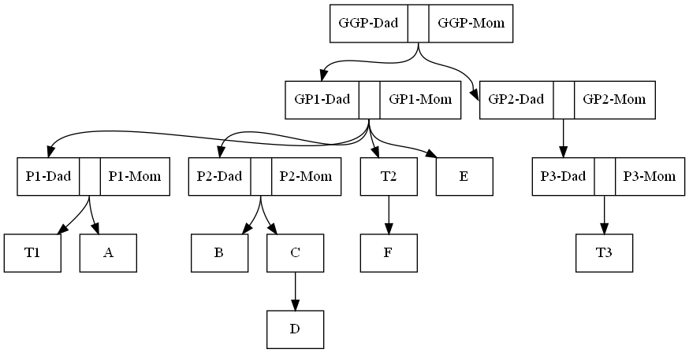
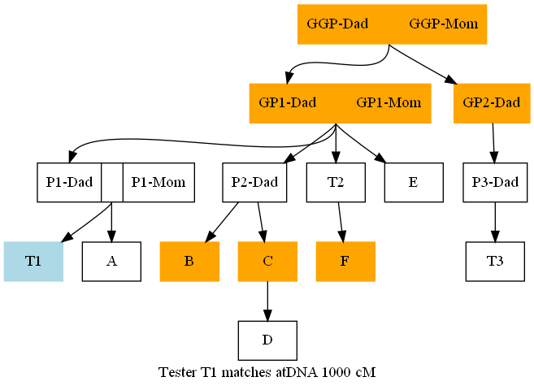
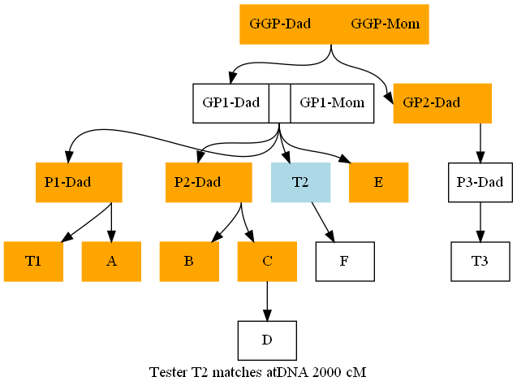
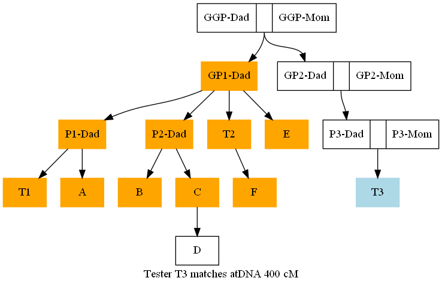
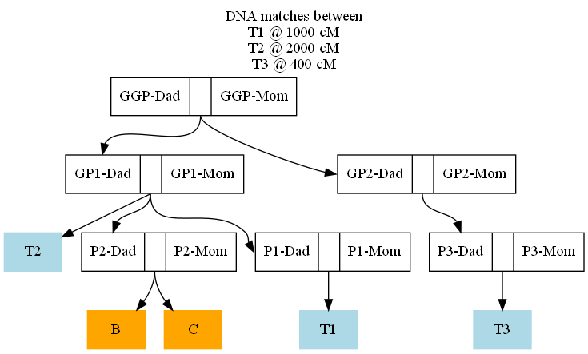

# dna-multi-match
Find the intersection of DNA matches of multiple family members.

The example below provides a scenario which illustrates the program's function.

It is also possible to perform a speculation test by making a different input file with people placed in the tree where unknown relatives might exist.

## Features

- Output is a [Graphviz](https://graphviz.org) DOT file.
- Makes use of [readgedcom.py](https://github.com/johnandrea/readgedcom) library.

## Limitations

- Requires Python 3.6+
- Might not handle "half" relationships properly.

## Installation

No installation process. Copy the program and the library.

## Input

The input is a GEDCOM file exported from a genealogy program.

Note that because the --testers option is a space delimited list, the input file should be
given as the first item on the command line.

## Options

--testers  id1,dna1 id2,dna2 id3,dna3 ...

This is the set testers info to consider for the family matching.
Given as a list of as a space separated list of pairs with each pair as tester-id (see id-item)
comma DNA value in cM.

--id-item=value

This is the item which will identify the tester. Default is "xref" which is the individual
XREF value in the GEDCOM file.
Other options might be "uuid", etc. If using a GEDCOM custom type specify it as "type." followed by
the type name, such as "type.extid", "type.refnumber", etc.

--max-results=value

More than this many final matches is considered too many to display. Default is 14.

--min-testers=value

At least this many testers is required for the program to run. Default is 3

--smallest-match=value

At least one of the testers must have a DNA match value (in cM) for the program
to run. Default is 866 which is the average value for a 1st cousin match.

--show-each

If added then the intermediate match results for each tester will be printed to std-err.

--orientation=direction

Change the orientatation of the diagram in the DOT file output. Default is "TB" for top-to-bottom.
Other choices are "LR" for left to right plus "BT" and "RL".

--reverse-arrows

Change the direction of the arrows which usually point from parent to child.

--libpath=relative-path-to-library

The directory containing the readgedcom library, relative to the . Default is ".", the same location as this program file.

## Usage

```
dna-multi-match.py family.ged --testers id1,dna1 id2,dna2 id3,dna3 ... >out.dot  2>out.err
graphviz -Tpng out.dot -o out.png
graphviz -Tsvg out.dot -o out.svg
```

## Example

Several people in a family have taken a DNA test, but each has a matched family member which they can't identify.
They want to find the person who is common among all their potential matches.
The known generalogy is illustrated here:



There are three DNA testers named T1, T2, T3.

T1 matched the unidentified person at 1000 cM. It could be one of the these blood relatives marked in orange:



T2 matched the unidentified person at 2000 cM. It could be one of these blood relatives marked in orange:



T3 matched the unidentified person at 400 cM. It could be one of these blood relatives marked in orange:



In the input GEDCOM file T1 has the xref of @I1@, T2 has the xref of @I11@, and T3 has the xref of @I21@. The program was run like this to compute the intersection of all the potential matches.

```
dna-multi-match.py family.ged --testers 1,1000 11,2000 21,400  >f.dot  2>f.err
graphviz -Tpng f.dot -o f.png
```

The program prints (in f.err) the results:

```
The intersection of matches has 2 people
    B (xref 15)
    C (xref 16)
```

The output diagram is:



indicating that the unidentified person is either "B" or "C". Or the person might be someone not yet known genealogically.


## Bug reports

This code is provided with neither support nor warranty.

### Future enhancements

- Ensure "half" relationships are hendled properly
- Handle non_ASCII names in a manner better for SVG output.
- Handle family matched above the tree top.
