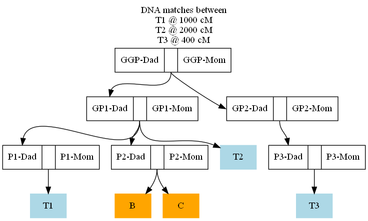

# dna-multi-match
Find the intersection of DNA matches of multiple family members.

The example below provides a scenario which illustrates the program's function.

It is also possible to perform a speculation test by making a different input file with people placed in the tree where an unknown relative might exist.

## Features

- Output is a [Graphviz](https://graphviz.org) DOT file.
- Makes use of [readgedcom.py](https://github.com/johnandrea/readgedcom) library.

## Limitations

- Requires Python 3.6+
- Might not handle "half" relationships properly.

## Installation

No installation process. Copy the program and the library.

## Input

The input is a GEDCOM file exported from a genealogy program.

## Options

--testers  list of pairs of matches

--iditem=value

Default is "xref".

--max-results=value

Default is 14.

--min-testers=value

Default is 3

--smallest-match=value

Default is 866.

--show-each

If added then the intermeduate match results for each tester will be printed to std-err.
Might generate a lot of output.

--orientation=direction

Change the orientatation of the diagram in the DOT file output. Default is "TB" for top-to-bottom.
Other choices are "LR" for left to right plus "BT" and "RL".

--reverse

Change the direction of the arrows which usually point from parent to child.

--libpath=relative-path-to-library

The directory containing the readgedcom library, relative to the . Default is ".", the same location as this program file.

## Usage

```
dna-multi-match.py family.ged --testers id1,dna1 id2,dna2 id3,dna3 ... >out.dot  2>out.err
graphviz -Tpng out.dot -o out.png
graphviz -Tsvg out.dot -o out.svg
```

## Example

Several people in a family have taken a DNA test, but each has a matched family member which they can't identify.
They want to find the person who is common among all their potential matches.
The known generalogy is illustrated here:


There are three DNA testers named T1, T2, T3.

T1 matched the unidentified person at 1000 cM. It could be one of the these blood relatives marked in orange:


T2 matched the unidentified person at 2000 cM. It could be one of these blood relatives marked in orange:


T3 matched the unidentified person at 400 cM. It could be one of these blood relatives marked in orange:


The program was run like this to compute the intersection of all the potential matches.

```
dna-multi-match.py family.ged --testers 1,1000 11,2000 21,400  >f.dot  2>f.err
graphviz -Tpng f.dot -o f.png
```

The program prints (in f.err) the results:

```
The intersection of matches has 2 people
    B (xref 15)
    C (xref 16)
```

The output diagram is:



indicating that the unidentified person is either "B" or "C". Or the person might be someone not yet known genealogically.


## Bug reports

This code is provided with neither support nor warranty.

### Future enhancements

- Ensure "half" relationships are hendled properly
- Handle non_ASCII names in a manner better for SVG output.
- Handle family matched above the tree top.
